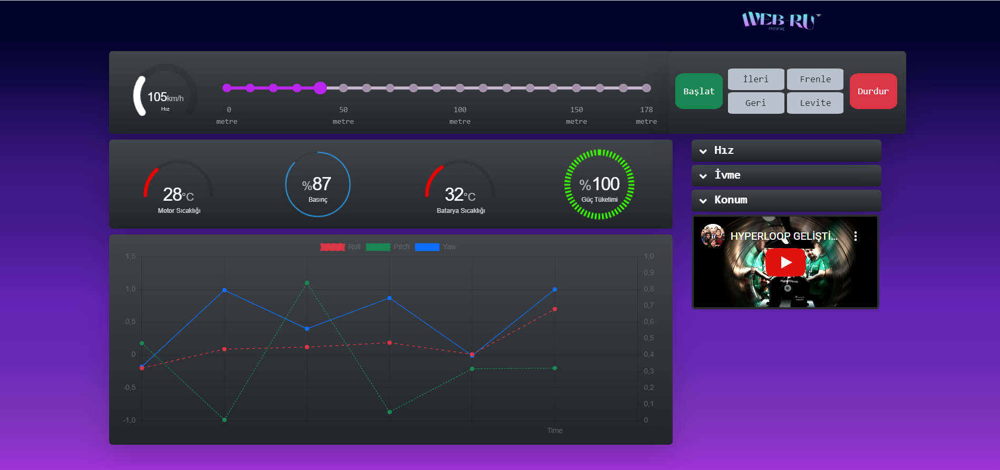
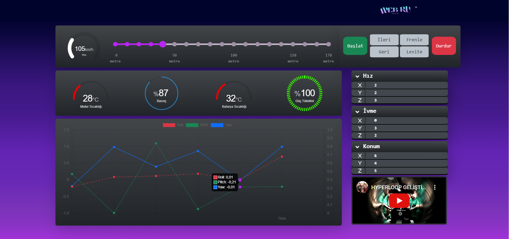

# Teknofest 2022 Hyperloop Web Interface Project

This repository contains the source code for a web interface specifically designed for the Teknofest 2022 Hyperloop category. The project was developed using modern web technologies such as HTML, CSS, and JavaScript.

## Project Features

In this project, various and aesthetically pleasing gauges are used to enhance user experience and present data more effectively.

## Project Visuals

Below are screenshots of the project while it is running:

